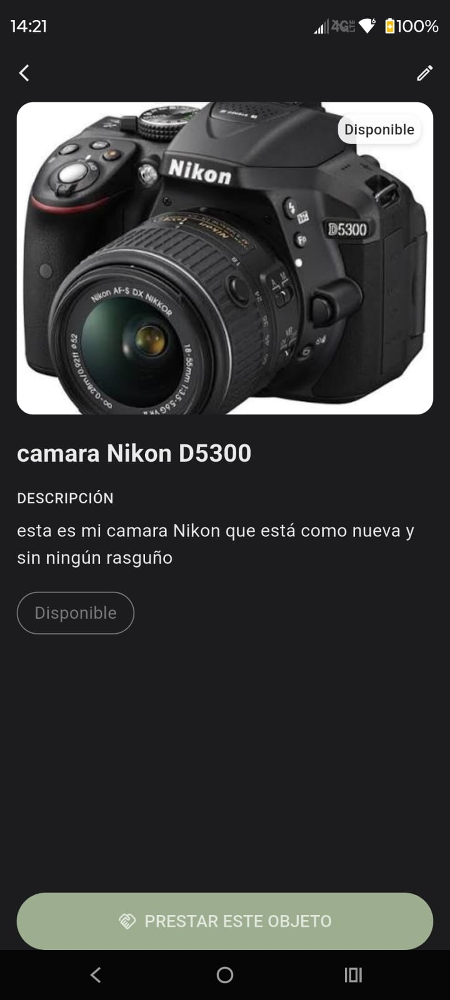
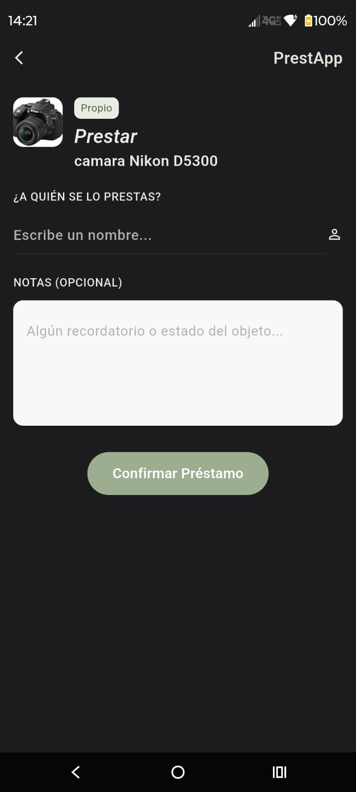
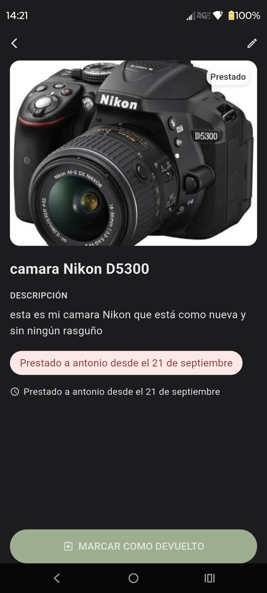
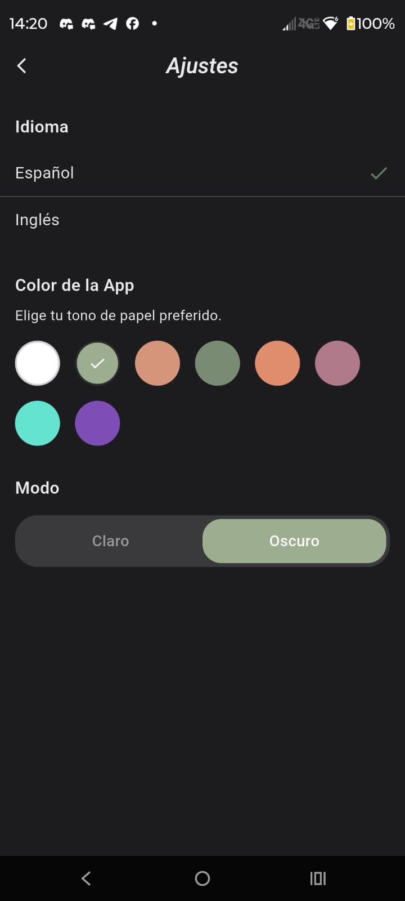

# 📦 PrestApp


**PrestApp** es una aplicación móvil para Android construida con Flutter, diseñada para resolver un problema muy común: olvidar a quién le prestaste tus cosas. Con PrestApp, puedes llevar un registro detallado de tus objetos, a quién se los has prestado y desde cuándo.

## ✨ Características Principales

* **Gestión de Inventario:** Agrega tus objetos con fotos, título y descripción.
* **Control de Préstamos:** Marca un objeto como prestado, registra el nombre de la persona y añade notas opcionales.
* **Historial de Devoluciones:** Marca los objetos como devueltos y mantén un historial de tus movimientos.
* **Personalización Total:** 
  * Soporte para **Modo Claro y Modo Oscuro**.
  * Paleta de colores personalizable (elige tu tono de acento preferido).
* **Multidioma:** Soporte integrado para Español e Inglés.

## 📸 Capturas de Pantalla

A continuación, un vistazo a la interfaz de la aplicación:

| Detalles del Objeto | Pantalla de Préstamo |
|:---:|:---:|
|  |  |
| *Vista de un objeto disponible en tu inventario.* | *Formulario para registrar a quién le prestas el objeto.* |

| Estado Prestado | Ajustes y Personalización |
|:---:|:---:|
|  |  |
| *Visualización del objeto indicando a quién y desde cuándo se prestó.* | *Menú de ajustes con opciones de idioma, color y tema.* |

*(Nota: Para que las imágenes se vean en GitHub, crea una carpeta llamada `screenshots` en la raíz de tu repositorio y guarda ahí las imágenes con los nombres indicados en los enlaces de arriba).*

## 🛠️ Tecnologías Utilizadas

* **Framework:** [Flutter](https://flutter.dev/)
* **Lenguaje:** [Dart](https://dart.dev/)
* **Plataforma Objetivo:** Android

## 🤖 Desarrollo Asistido por IA

Este proyecto es especial porque fue construido y estructurado con la ayuda de **Inteligencia Artificial**. El uso de herramientas de IA permitió acelerar el proceso de desarrollo, mejorar la lógica del código en Dart, optimizar la interfaz de usuario en Flutter y resolver problemas técnicos de manera eficiente, demostrando el potencial de la colaboración entre desarrolladores humanos y asistentes de IA.

## 🚀 Cómo ejecutar el proyecto localmente

Si deseas clonar y probar este proyecto en tu entorno local, sigue estos pasos:

1. Asegúrate de tener [Flutter SDK](https://docs.flutter.dev/get-started/install) instalado.
2. Clona este repositorio:
   ```bash
   git clone https://github.com/springveil27/Prestapp.git
   ```
3. Navega al directorio del proyecto:
   ```bash
   cd Prestapp
   ```
4. Instala las dependencias:
   ```bash
   flutter pub get
   ```
5. Ejecuta la aplicación en tu emulador o dispositivo físico:
   ```bash
   flutter run
   ```

## 🤝 Contribuciones

¡Las contribuciones, problemas (issues) y solicitudes de extracción (pull requests) son bienvenidos! Siéntete libre de revisar la [página de issues](https://github.com/springveil27/Prestapp/issues) si quieres colaborar.

## 📄 Licencia

Este proyecto es de código abierto. Siéntete libre de usarlo, modificarlo y compartirlo.
